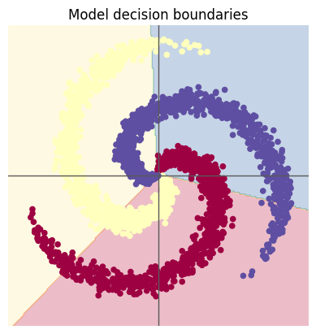
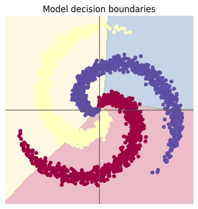
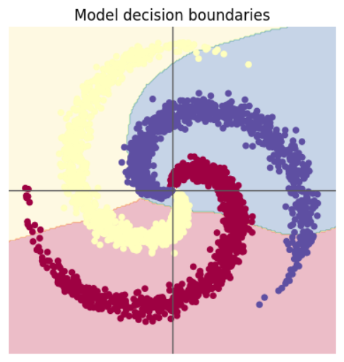

# 深度学习第一周
## 代码实验  
根据实验环节的螺旋数据分类，成功跑通了，但是训练效果不是很好，正确率维持在0.5出头，和瞎猜相比强不了多少。代码和实验环节的代码一样，在添加ReLU前和添加ReLU后并没有明显的正确率提升。  
  
  
在尝试将隐藏层中的神经元从100改为50个后，准确率反而上升至0.63。  
  
尝试了多次不同的神经元数量，最后结果都不过0.63，且都是50个的时候甚至结果还不一样，给我一种炼丹的感觉。多次训练中也常常出现acc先上升后下降的情况，且下降程度也很高。可以说有很多奇怪的问题。  
## 问题总结  
### AlexNet与LeNet  
1.AlexNet使用ReLU激活函数，导数为1可以有效缓解深层神经网络的梯度消失问题
2.Dropout可以防止过拟合  
3.使用GPU训练，效率更高，可以训练大量数据集  
4.由以上几个优点，可以有效训练更深层更宽的神经网络，性能当然优于LeNet  
### 激活函数  
1.激活函数相对于每个神经元属于非线性变换，以解决线性函数不可解决的问题，比如异或等分类  
2.指定输出范围，如sigmoid可以指定输出为0-1，用于逻辑回归  
3.缓解梯度消失，如ReLU，导数为1或0，可用于深层神经网络训练  
### 梯度消失  
当神经网络层数很深时，因为最终的梯度是几个梯度连乘，所以当多个梯度小于1时，最终会使传播到前几层的梯度趋于0，导致更新不动参数，无法学习。特别是使用sigmoid时，每个激活函数的梯度都小于1，这使sigmoid几乎训练不了深层网络，只能逐层使用自编码或者有限玻尔兹曼机训练。  
### 神经网络的宽与深  
1.一般而言更深更好，更深贡献是指数增长，更宽贡献为线性增长  
2.不过过深存在梯度消失现象，所以一般优先更深，适当加宽。  
### Softmax  
- Softmax相当于把一堆数经过运算映射为相对应的权重或者说概率，但相对于直接用加权平均来说，数值之间的差异更大，最高项会更接近1，即相当于给予更多的奖励。  
### SGD和Adam  
1.SGD就是传统的梯度下降，一个当前梯度更新一次。  
2.Adam相当于加入类似于惯性的梯度，把上一次的更新用的梯度当做惯性项，占比更大，这一次的计算出的梯度占比更小，相当于一点点改变当前状态。且加入自适应步长，能放大缩小梯度。一二阶动量一起作用使得每个梯度都**有效**且**不会变化过于快**，有效防止了SGD中因为学习率设置使损失函数来回跳动或者走不动的情况。  
- 一般来说更建议用Adam或者AdamW，每个梯度结合作用，且学习率不用给的很好，适合快速实验。再用SGD精调(Adam会自动把大梯度变小导致陷入局部最优无法出去0)，能够停在平缓地带，泛化效果好  
  
## 另附第一周课程笔记  
### 单层感知机实现基本逻辑单元
1.逻辑非  
res = sigmoid(10-20x1)  
2.逻辑或  
res = sigmoid(-10+20x1+20x2)  
3.逻辑与  
res = sigmoid(-30+20x1+20x2)  
### 单层感知机解决不了非线性问题  
- 那就使用多个单层感知机组成多层感知机
- 根据某 [网页](https://playground.tensorflow.org/) 能直观看到添加隐藏层对学习的重要性，即单层只能解决线性问题，即与或非。多层可以拟合为不断进行与或非等门逻辑的叠加，即可通过数值直接模拟门逻辑来学习
- 神经网络学习通过线性变换与非线性变换将原空间变换为可分类的空间  
### 神经网络该更深还是更宽？  
- 深度贡献为指数增长，宽度贡献为线性增长
### 多隐层的梯度消失问题  
- 隐层越多，越传递到前面，各偏导相乘(如sigmoid，导数<=0.25)，梯度越小，参数越难更新，因此即易陷入局部极值  
- 所以三层神经网络是主流  
- 逐层预训练，以三层为最小单元逐层训练  
### 无监督信息的学习  
- 受限玻尔兹曼机。玻尔兹曼能量分布，能量越低越稳定，系统有趋于这个状态的趋势。标准波尔兹曼分布得到的条件概率等于sigmoid函数。  
- 自编码器，假设输入与输出相同，将input输入encoder，得到code，在通过decoder解码输出，与input比较  