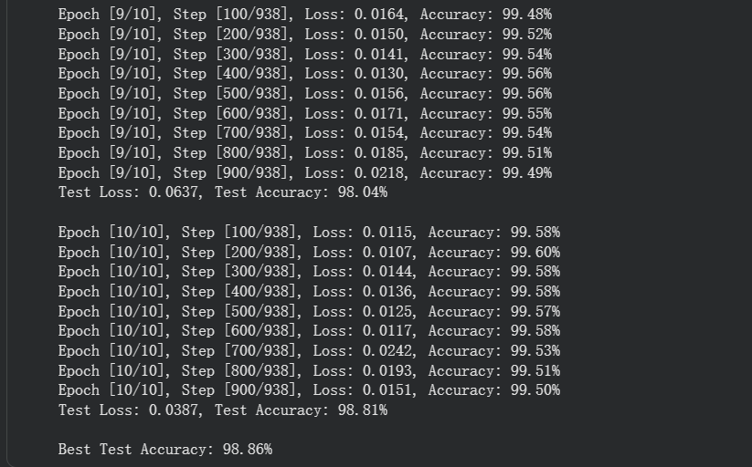
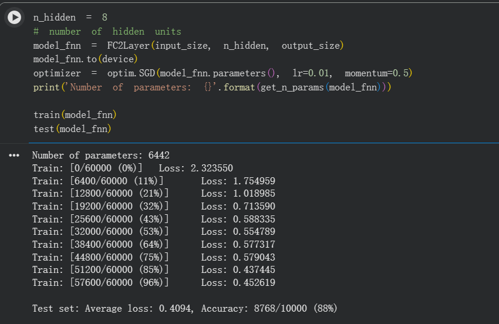
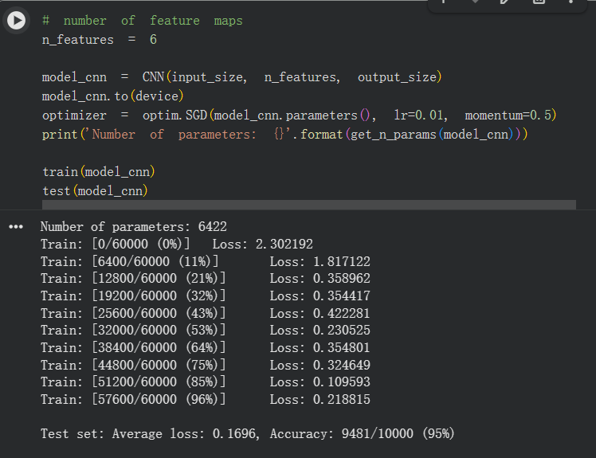
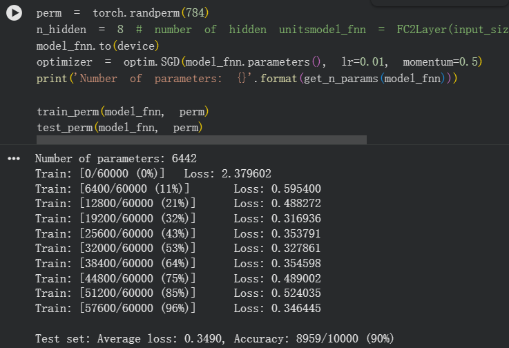
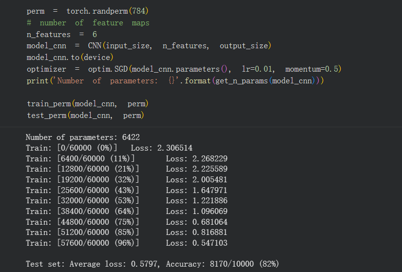
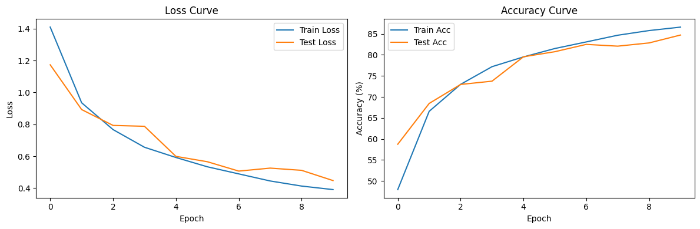
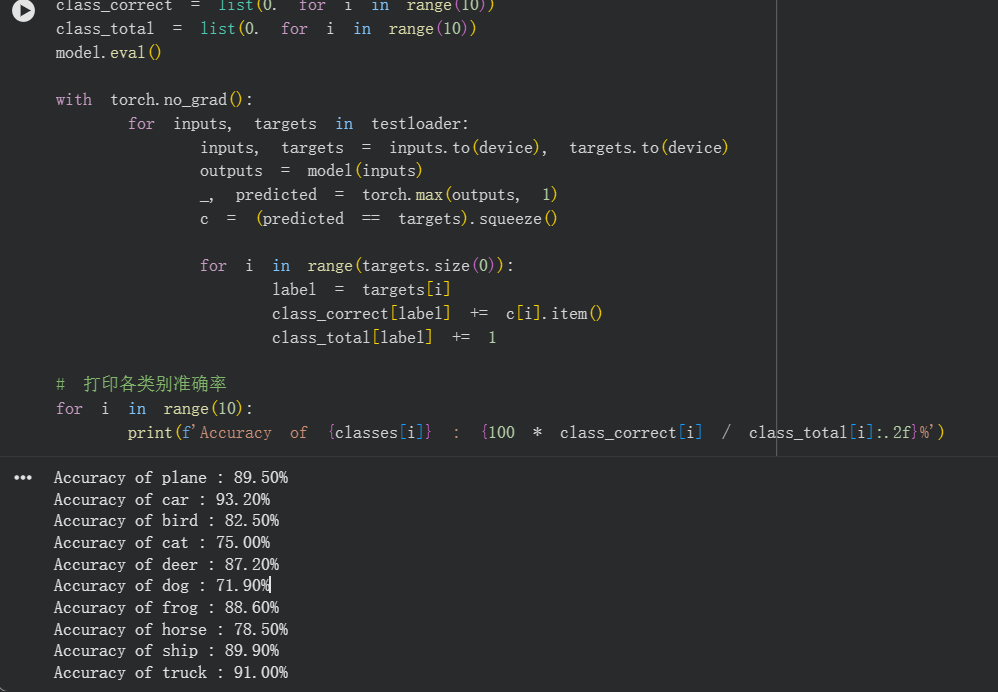
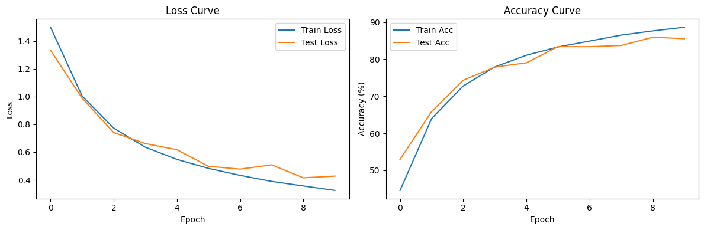
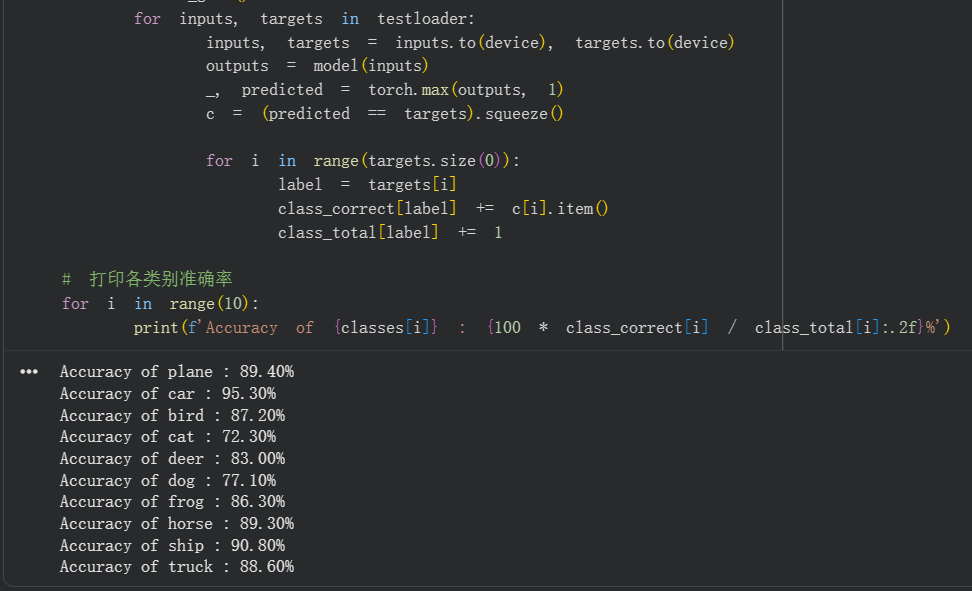

# 深度学习第二周-卷积神经网络  
## 思考题  
1.dataloader里的shuffle参数控制样本顺序是否随机打乱。shuffle = True打乱，用于训练集；shuffle = False不打乱，用于测试集。  
2.transform里各种操作表示对数据的预处理，包括数据增强如不同位置，水平翻转，裁剪等，也包括对图片数值的压缩和归一化，使其数值变为均值为0，方差为1的标准数据。  
3.epoch指代训练轮数，指全部训练集一共训练了几次；batch指一次送入多少样本，当样本量很大时需要一批批送入GPU计算。  
4.1*1卷积为二维处理，保留了空间位置信息，同时也可以改变通道数量；fc全连接层为一维处理，无需位置信息，参数独立，没有权重共享。  
  
## 代码实验  
### 1.LeNet对MNIST数据集分类  

### 2.MLP和CNN分别对MNIST数据集分类  
- MLP在数据集像素顺序被打乱时优于CNN，反之没打乱CNN优于MLP，本质还是CNN卷积记住了位置信息,打乱之后学习位置信息无意义  
  
  
  
  
### 3.使用VGG对CIFAR10分类  
  
  
### 4.使用ResNet18对CIFAR10分类  
  
  
  
## 视频笔记
## 1.传统神经网络与卷积神经网络  
- 全连接处理图片时，参数太多会导致过拟合。  
- 卷积神经网络局部关联，参数共享  
## 2.基本组成结构  
### 2.1 卷积  
- 一维卷积为信号的掩饰叠加，图像处理更多用二维，用kernel/filter卷积核/滤波器来对图像操作。  
### 2.2 池化  
- 保留主要特征，减少参数和计算量，防止过拟合；处于卷积层和卷积层间，全连接层与全连接层之间。  
- 包括最大值池化与平均值池化  
### 2.3 全连接层  
- 一般在卷积神经网络尾部  
## 3.卷积神经网络典型结构  
### 3.1 AlexNet  
- ImageNet大数据训练，ReLU，Dropout、Data augmentation防止过拟合，双GPU训练  
- ReLU解决梯度消失，计算速度快(判断输入是否大于0)，收敛速度快  
- Dropout(随机失活)，训练时随机关闭部分神经元  
- Data augmentation(数据增强)，平移，翻转，对称，高斯扰动  
- VGG，相对于AlexNet网络更深  
- GoogleNet，除了类别输出层之外，没有额外的全连接层  
- ResNet(残差学习网络)，深度有152层。通过残差思想，把输入跳过两层再输入，即F(x)+x，模型自主训练有多少层，且不丢失梯度，因为导数为1+F'(x)